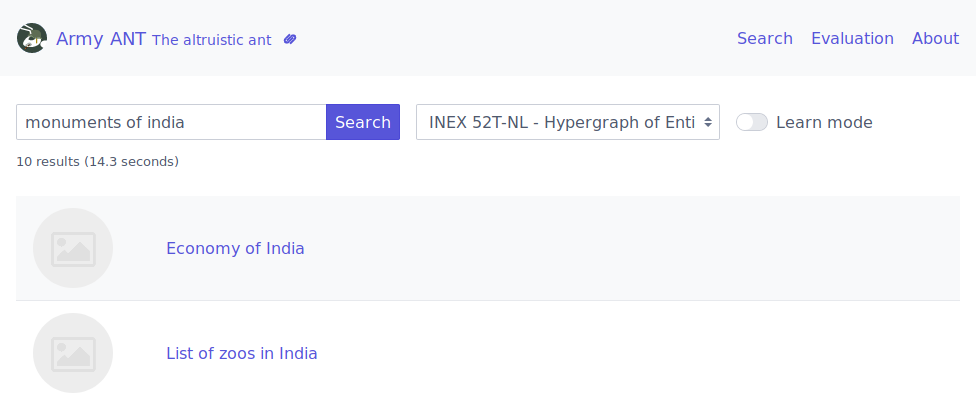
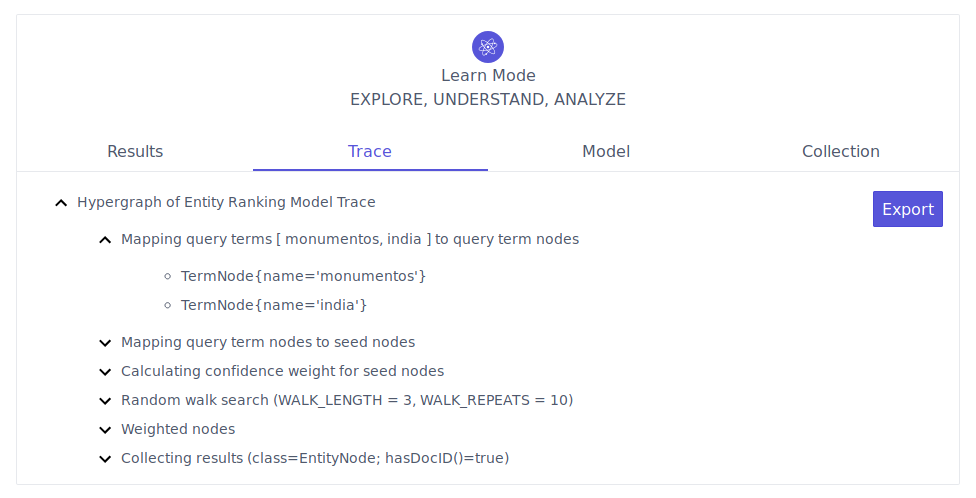
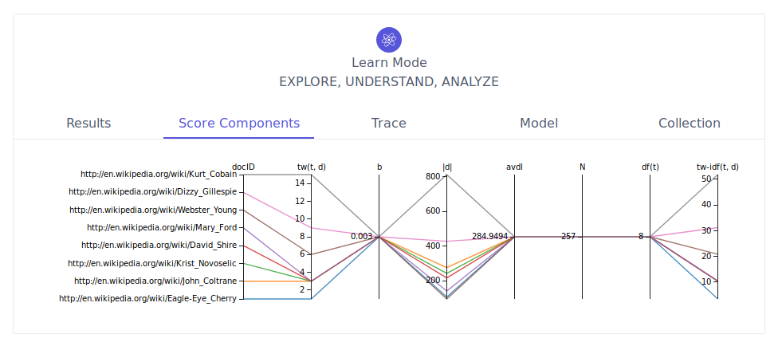
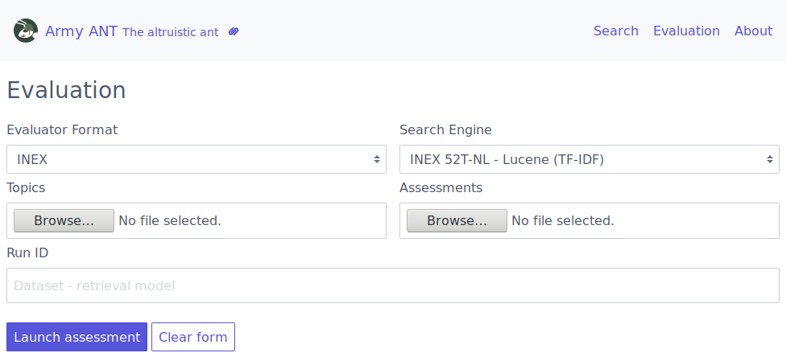
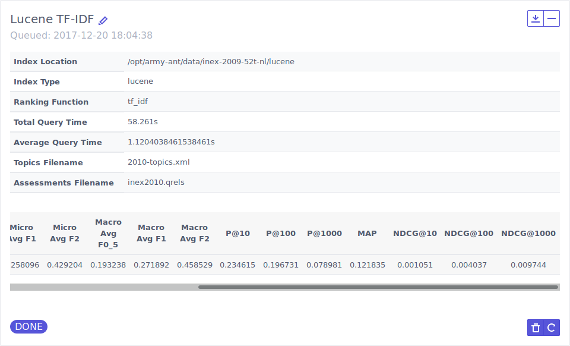
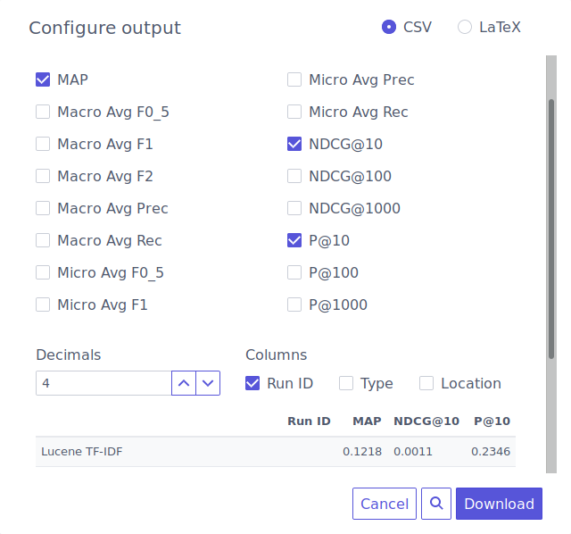

#  Army ANT

For the time being, you can refer to Chapter 2 of the technical report I wrote for MAP-i's Scientific Activities, for documentation about Army ANT: [Army ANT: A Workbench for Innovation in Entity-Oriented Search](http://hdl.handle.net/10216/110181).

As an information retrieval researcher, defining an engine in Army ANT (i.e., implementing an `index()` and `search()` methods) will give you direct access to a web interface with the following features. You can check [Army ANT's sequence diagram](resources/army_ant-sequence_diagram.pdf) to better understand what a typical workflow looks like.

You can also check  for command line examples for `index` and `extras`, as well as  for information about the demo instance and how to install it using Docker.

**Basic search interface:**

**Learn mode - Ranking function trace tree:**

**Learn mode - Parallel coordinates visualization of individual score components, for a query:**

**Evaluation - Queue up evaluation tasks:**

**Evaluation - Access evaluation task results, including computed metrics and a ZIP file with details:**

**Evaluation - Export your evaluation session as a CSV or LaTeX table to include in your next scientific paper:**

## License

All source code is freely available under a standard [BSD 3-Clause license](https://opensource.org/licenses/BSD-3-Clause).

Copyright (c) 2018, FEUP InfoLab (http://infolab.fe.up.pt)

All rights reserved.

Redistribution and use in source and binary forms, with or without modification, are permitted provided that the following conditions are met:

1. Redistributions of source code must retain the above copyright notice, this list of conditions and the following disclaimer.

2. Redistributions in binary form must reproduce the above copyright notice, this list of conditions and the following disclaimer in the documentation and/or other materials provided with the distribution.

3. Neither the name of the copyright holder nor the names of its contributors may be used to endorse or promote products derived from this software without specific prior written permission.

THIS SOFTWARE IS PROVIDED BY THE COPYRIGHT HOLDERS AND CONTRIBUTORS "AS IS" AND ANY EXPRESS OR IMPLIED WARRANTIES, INCLUDING, BUT NOT LIMITED TO, THE IMPLIED WARRANTIES OF MERCHANTABILITY AND FITNESS FOR A PARTICULAR PURPOSE ARE DISCLAIMED. IN NO EVENT SHALL THE COPYRIGHT HOLDER OR CONTRIBUTORS BE LIABLE FOR ANY DIRECT, INDIRECT, INCIDENTAL, SPECIAL, EXEMPLARY, OR CONSEQUENTIAL DAMAGES (INCLUDING, BUT NOT LIMITED TO, PROCUREMENT OF SUBSTITUTE GOODS OR SERVICES; LOSS OF USE, DATA, OR PROFITS; OR BUSINESS INTERRUPTION) HOWEVER CAUSED AND ON ANY THEORY OF LIABILITY, WHETHER IN CONTRACT, STRICT LIABILITY, OR TORT (INCLUDING NEGLIGENCE OR OTHERWISE) ARISING IN ANY WAY OUT OF THE USE OF THIS SOFTWARE, EVEN IF ADVISED OF THE POSSIBILITY OF SUCH DAMAGE.