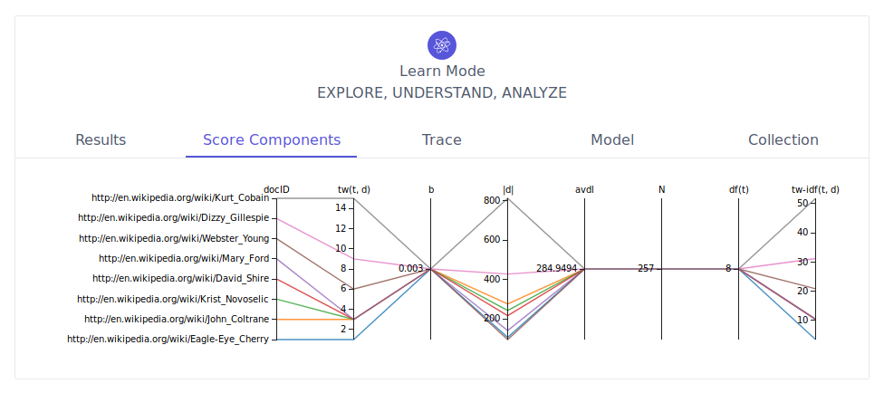
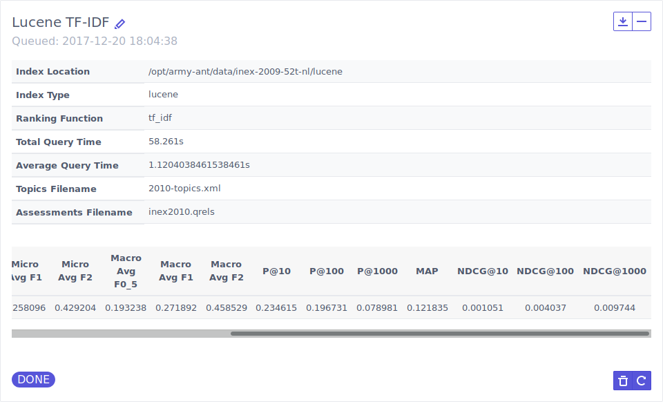
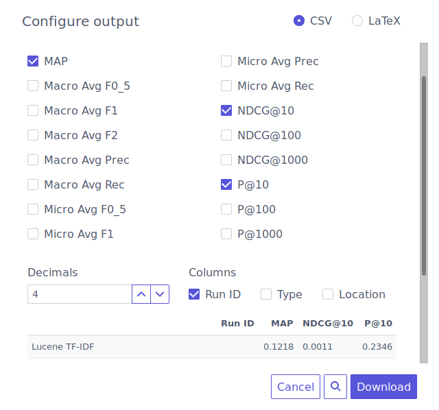

# Screenshots

**Basic search interface:**

**Learn mode - Ranking function trace tree:**

**Learn mode - Parallel coordinates visualization of individual score components, for a query:**

**Evaluation - Queue up evaluation tasks:**

**Evaluation - Access evaluation task results, including computed metrics and a ZIP file with details:**

**Evaluation - Export your evaluation session as a CSV or LaTeX table to include in your next scientific paper:**

